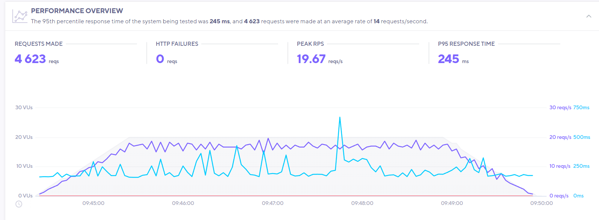
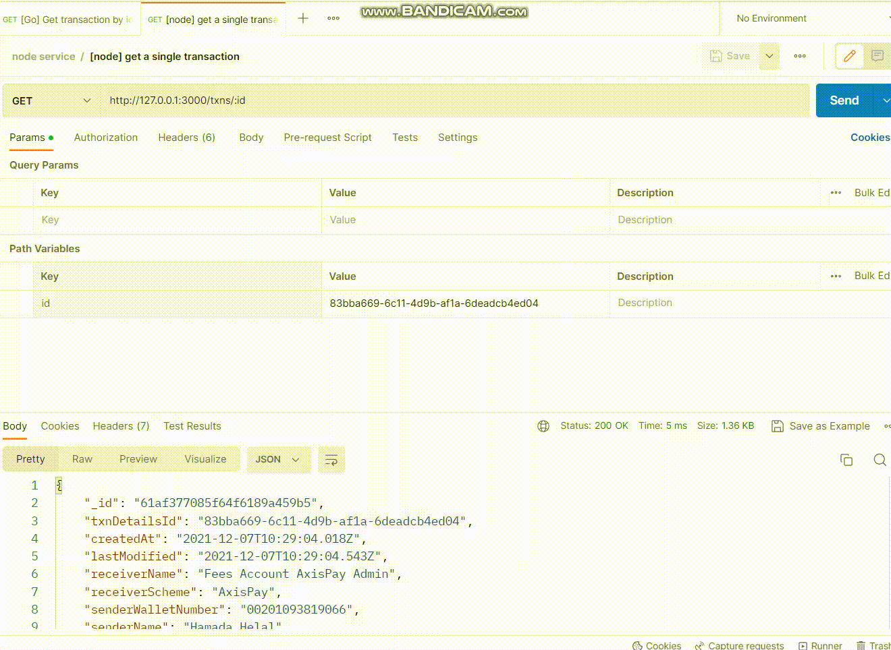
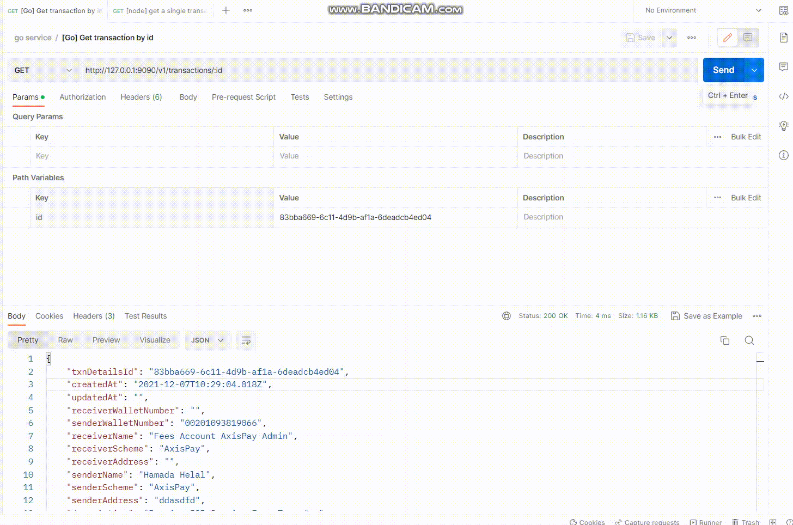
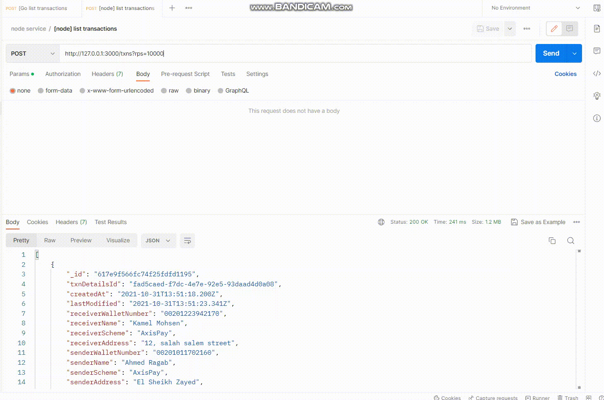
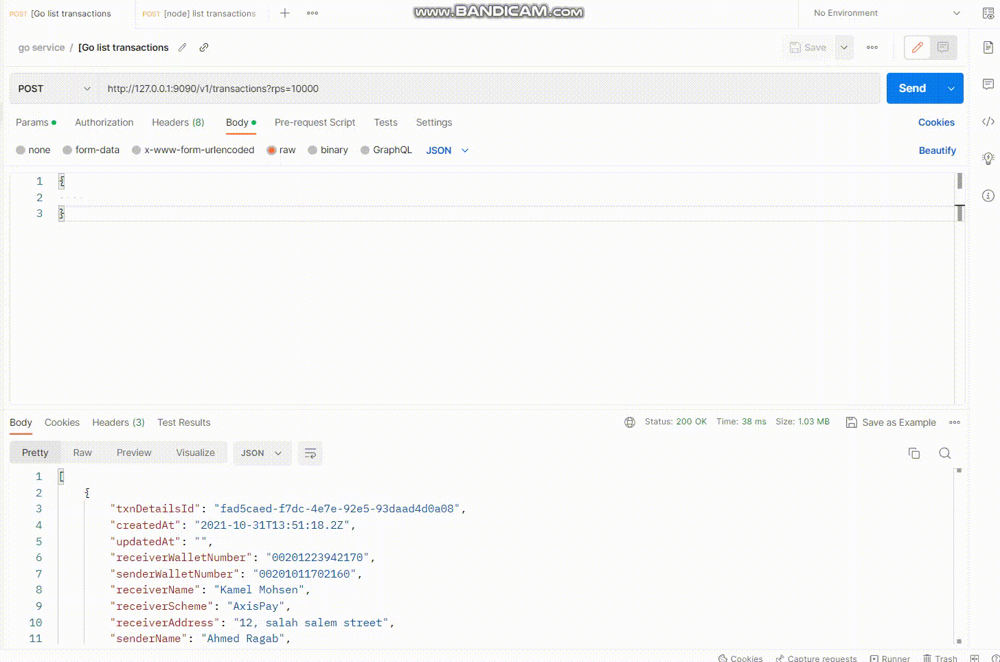

# **Introduction**

This repository demonstrates the performance difference and advantages of using Go with MongoDB, and how it can be incorporated into our development stack. The HTTP server is bootstrapped using [Gin](https://gin-gonic.com/)
framework.

Gin by default executes each incoming request in a separate go routine (lightweight thread). This allows the framework to handle high levels of concurrency and process multiple requests simultaneously without blocking.

---

---

## **Setup**

- Install Node.js and npm.
- Install the latest version of Go.
- Make sure you have axisPayCore database and transactionDetails collection in your local mongo server
- Run both services. You can start the Go server by navigating to the project directory and typing "go run main.go".

---

# **K6 Test Results**

I used k6, a load testing tool built by the Grafana team, for the load testing experiment. This tool is built with Go and does not operate inside the Node runtime, which is why it supports concurrent requests with its virtual user concept.

> **Note**: all the tests ran for 6 mins with 20 concurrent virtual user

##

##

### case 1 → Fetching 20 records per request.

- node

# 

- go

# 

the difference here is noticeable in the response time but not that significant because the operation is not cpu intensive memory consuming and the response payload is not big

### case 2 → Fetching 100 records per request.

- node

# 

- go

# 

the same happens here node still handles the load well, but there's an increase in the response time, go still wins

### case 3 → Fetching 1000 records per request.

- node

# 

# 

- go

# 

Go in this example handles the load very well with no issues, node on the other hand struggles with big payloads queries due to its single-threaded nature

##

##

# Postman Test Results (_for the sake of it_)

### first, fetching a single document with both servers

## 

---

---

## 

---

---

### fetching 1000 document

---

---

### fetching 10,000 documents in node

## 

---

---

### fetching 10,000 documents in go

## 
