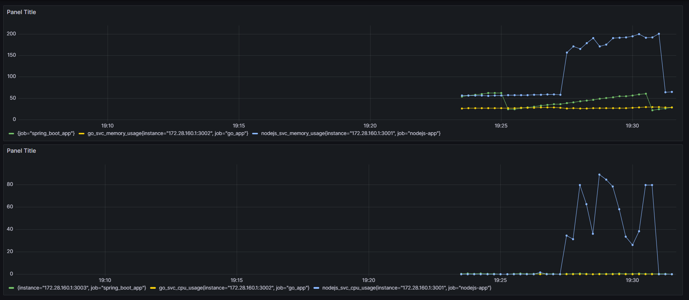
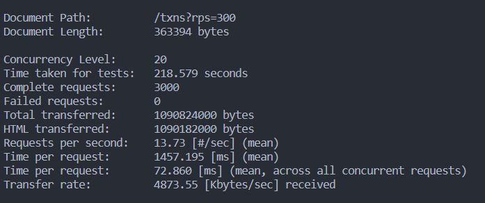
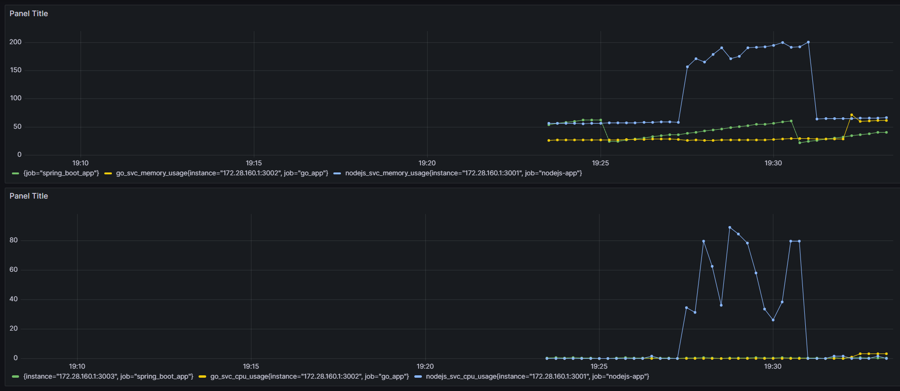
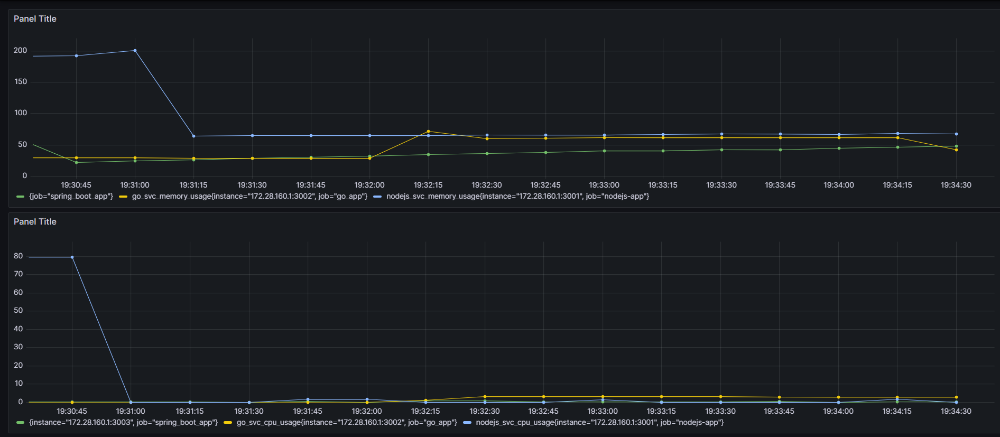
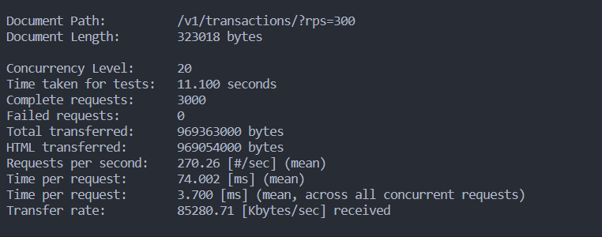
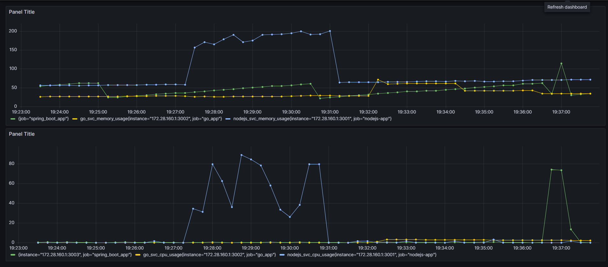
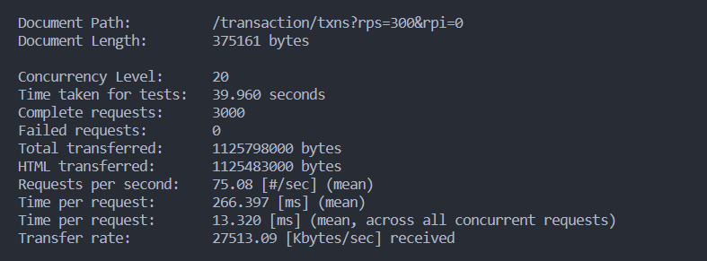
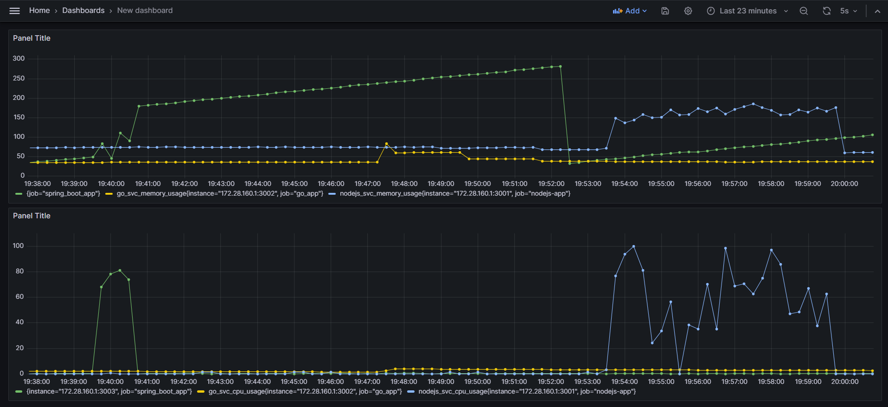

## Load Testing With Prometheus and Grafana

---

In order to measure the amount of memory and cpu time consumed by every service I created this project using the following technologies:

- **Prometheus**: for querying metrics info from each service by exposing a "/metrics" API that's called by prometheus server to pull cpu and memory data.
- **Grafana**: for displaying the data gathered by prometheus in a clear dashboard
- **Apache Bench**: for executing the load testing scripts locally

---

### Test Results

| Language | Color                                    |
| -------- | ---------------------------------------- |
| Node     | blue     |
| Java     | green   |
| Go       | yellow |

---

- Fetching 3000 requests wih 20 concurrent connections in node
  
  

  as shown here node is not the best option for this kind of operation because it is a single threaded language and it's not that fast in terms of execution time and for the cpu and memory usage it is not that good either.

---

- Fetching 3000 requests wih 20 concurrent connections in Go
  

  > _zoomed-in for better visibility_

  
  

  go here runs smoothly in all aspects, it's fast, it's memory efficient and it's cpu efficient.

---

- Fetching 3000 requests wih 20 concurrent connections in Java
  
  

  java is good in terms of execution time but it's not that good in terms of memory consumption and cpu usage compared to go

---

- Fetching 5000 requests wih 20 concurrent connections all services
  

  When I ran this test node and go executed as expected, node's response time and
  memory footprint increased but Go's stayed the same. Java on the other hand had a huge spike in memory usage even after the test was done, that's because of its garbage collector.

  Both Java and Go use garbage collection to manage memory, but Go's garbage collector is designed to be more efficient and have less impact on CPU and memory usage than Java's.

  Go uses a concurrent garbage collector that runs concurrently with the application, rather than pausing the application for garbage collection. This reduces the impact of garbage collection on our resources and allows the application to continue running smoothly.

  Java garbage collector identifies objects that are no longer being used by the program and frees the memory associated with those objects. However, in order to do this, the garbage collector needs to temporarily allocate additional memory to perform its analysis and bookkeeping.
